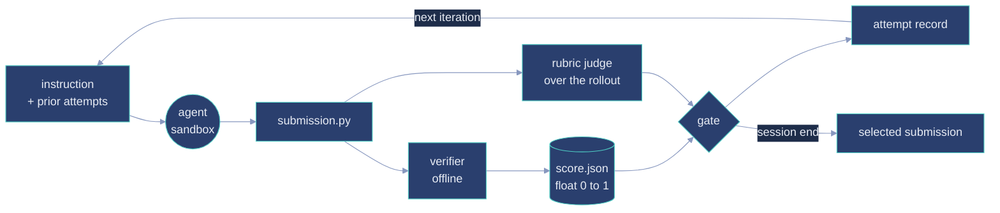

# KARA Samples

KARA is a family of open-ended reinforcement-learning environments in which a coding agent must build the *smallest* transformer that computes multi-digit arithmetic exactly, scored by a bounded continuous reward it can keep improving across a long refinement loop.

[](LICENSE)

This repository holds sample deliveries: complete Harbor task bundles exactly as they were graded, together with the recorded refinement sessions that were run against them. Where SWE-style benchmarks ask a binary question — does the patch make the suite green — a KARA task hands the agent a working but deliberately weak implementation and asks it to keep going: reach the accuracy bar, then shrink the model, then shrink it again. There is no point at which the objective is satisfied and the agent should stop.

Each task directory is one self-contained delivery: the frozen bundle as graded, and the sessions run against it. Per-task results, cohort figures, and the caveats that govern quoting any number from a run live in that task's own `README.md`. This document covers the format and the mechanism, which are the same for every task.

## Task formulation

A KARA task is an instruction, a containerized sandbox, a sub-optimal starting implementation, a hidden graded test set, and a deterministic grader. The instruction is written the way an engineer would receive the assignment — an objective and a contract, not a specification of the expected output.

The agent produces one graded file, `/workspace/submission.py`, exposing a constructor and the entry point its family is named for:

```python
build_model() -> (torch.nn.Module, dict)   # the model and its metadata

# the family entry point — addition over two operands of width w, for example:
add(model, a: int, b: int) -> int          # the exact sum, for operands in [0, 10**w - 1]
```

The second signature is the one that varies across the library. A task's **family** fixes which operation the entry point computes and how many operands it takes; its **width** fixes the domain each operand is drawn from. Everything else in this document holds for every task.

The accuracy bar is declared per task in `tests/spec.json`, and it is exact match — the answer is right or it is not. Every point below the bar is still worth something, so the score is a gradient rather than a gate, and what the agent optimizes once it clears the bar is unique parameter count.

The constraints are what make this hard rather than a scripting exercise. The returned model must be a genuine transformer whose self-attention depends on its input; every answer the entry point returns must come from a forward pass of that model; every learned float must be a registered parameter, counted by the grader from tensors rather than from anything the metadata claims; and the weights must come from training the agent ran itself, inside the environment. Training code is not allowed in the graded file — the shipped `train.py` demonstrates the intended split, writing learned weights into `submission.py`, which is the only file final grading imports.

The named failure mode is **chained-precision survival**: one wrong digit anywhere in a full-width chain zeroes the exact match for that instance, so a model that is almost right is worth very little, and the transition from "almost" to "exact" tends to be sharp rather than gradual. Widening the operands or adding another one lengthens the chain that has to survive intact.

## Score

The verifier writes one float in the closed interval `[0, 1]`, continuous and monotone in every quantity it measures:

```
score = (0.5 + 0.5 · parameter_efficiency) · accuracy_factor · edge_factor
```

- **`parameter_efficiency`** is piecewise-logarithmic in the measured parameter count, anchored on three numbers each task declares in `tests/spec.json`: a **floor** at which it saturates at 1.0, a **baseline** — the size of that task's shipped starting implementation — at which it steps to 0.15, and a **worst**, ten times the baseline by default, at or above which it is 0. Below the baseline every halving of the model is worth the same amount, all the way down, so shrinking never stops paying. Above the baseline the agent has not improved on what it was given, and the score says so — but a model ten times the baseline and one just above it are still distinguishable, which a hard zero would erase.
- **`accuracy_factor`** is exactly 1.0 at or above the task's declared threshold and decays as `(accuracy / threshold)³` below it. Meeting the threshold exactly is what keeps the score continuous there: the sub-threshold curve *meets* the qualifying value instead of jumping to it. A banded score would jump at the boundary, and that jump is what stalls a refinement loop — every exploratory step across the threshold would cost more than the step that motivated it.
- **`edge_factor`** is `edge_accuracy³` over the task's fixed edge cases — the full-width extremes and worst-case chains constructed from its own operand width — which decay faster than ordinary accuracy because they are the cases the task is actually about.

Integrity signals are hard gates, not quality measures: a structurally invalid submission, a non-positive parameter count, or any graded case answered without an observed forward call scores exactly **0.0**, with a machine-readable reason in `report.json`. Partial credit for those would be partial credit for cheating.

Consumers that need a hard predicate read the separate `qualified` field — accuracy at or above threshold *and* every edge case exact — which is unaffected by the continuity of the score.

Two independent numbers come out of a graded run, and they should not be collapsed:

| field | meaning |
|---|---|
| `score` | what the deterministic verifier measured |
| `qualified` | whether the submission met the accuracy and edge bars |
| rubric verdicts | whether an LLM judge, reading the recorded rollout, found the result was obtained honestly |

A run counts as correct only when it met the bar **and** every rubric passed. Ranking is on the gated figure; the raw measurement is kept beside it rather than overwritten, so a submission that measured well and was caught is visible as exactly that.

## What the verifier actually checks

Grading runs in a separate, offline container. The submission never executes in the same environment that holds the spec.

1. **Static screen** (`policy.py`) — the graded file must parse, define exactly one entry point for its family (`add` in the addition family), and import only from an allowlist (`torch`, `numpy`, `math`, `itertools`, `functools`, `collections`, `dataclasses`, `typing`). `eval`, `exec`, `open`, `__import__`, `compile`, `globals`, `locals` are refused. So is arithmetic performed directly on the entry point's own operands, in any of its shapes: `a + b`, `a += b`, `operator.add`, or the operands reduced through `sum`/`fsum`/`reduce`/`tensor`.
2. **Sandboxed execution** — the submission runs in a child process with privileges dropped to `nobody`, an empty `PYTHONPATH`, a scratch `HOME`, and its own timeout.
3. **Parameter recount** — parameters are counted from tensor storages, deduplicated by storage pointer, so aliased or reparametrized views cannot be double-spent and declared metadata is ignored entirely.
4. **Model-use coverage** — a forward pre-hook must fire for every single graded case. Anything less than full coverage is a zero.
5. **Attention presence** — satisfied by a `MultiheadAttention`, by a module named for attention, or by an inline `scaled_dot_product_attention` or softmax-over-matmul in the source. Name matching alone was wrong in both directions, so the source is read as well as the module tree.
6. **Attention non-degeneracy** — a module whose attention weights cannot respond to its input is a fixed reduction wearing the name. Five non-proportional value patterns are pushed through each attention module; if the ratio of its output to the input sum never moves, the submission is rejected with that stated as a finding, not as a silent zero.
7. **Output dependence** — every forward result is zeroed by a hook and the answers are recomputed over 24 probe instances drawn from a probe-specific seed that never overlaps the graded set. A genuine solver reads its answer off the model, so its answers must move. A submission that calls forward only to satisfy the liveness counter and computes the answer in Python leaves them unchanged — caught without any knowledge of what the task computes.
8. **Grading** — the task's fixed edge cases plus its declared count of seeded random instances at full width, both rebuilt from the seed in `spec.json`. Exact match only.
9. **Output tests** (`test_outputs.py`) — compiled assertions over the written score: in range, finite, qualification consistent with its own components, and no *unattributed* zero, meaning a zero score with every gate green is itself a failure.

## The refinement loop

A session is a fixed number of attempts against one frozen bundle, sharing one wall-clock budget rather than rationing it per attempt.



Each iteration is handed its own copy of the task, and that copy's `instruction.md` carries the record of every prior attempt with its score — the first iteration has none, by construction. The agent proposes an approach, implements it, is graded, and sees where it landed relative to its own history. At the end, a declared selection rule picks the submission that ships.

The loop is the point. A single-shot benchmark measures what a model knows; this measures whether it can hold an optimization target across many attempts, read its own score honestly, and improve on its own record instead of rediscovering the same local optimum.

## Task format

Bundles use the [Harbor](https://github.com/laude-institute/harbor) task format, schema 1.3. Each task directory is named by a `uuid5` over the canonical content of its bundle, so the name is its own integrity check.

```text
task.toml       Manifest: image digest, budgets, resources, network mode, tags
instruction.md  The open-ended objective the agent sees
environment/    Agent sandbox: Dockerfile, compose overlay, weak baseline + trainer
tests/          Verifier: test.sh, spec.json, the grader package, rubrics.jsonl
solution/       PRIVATE oracle: reference submission, solve.sh, TRUTH.md, rubrics.json
```

`task.toml` pins the environment by image digest and declares two very different halves of the run. The **agent** container is generous and connected — the delivered tasks give it 8 CPUs, 32 GB, and one GPU through a compose device reservation, with `network_mode = "public"` for the whole attempt so the agent can install whatever it needs. The **verifier** container is `environment_mode = "separate"`, `no-network`, smaller, and sealed. Budgets are declared as an attempt cap `N` and a `max_timeout` in hours. Every task carries `optimization` and `bounded-continuous` in its keywords, and declares its own `difficulty` and `category` under `[metadata]`.

`tests/spec.json` is the graded contract in one file — threshold, digit width, seed, test count, and the three parameter anchors — and it is self-identifying by `spec_digest`, so a delivery can be checked against the contract it claims to implement. The digest covers the contract, not the file: it is taken over the canonical JSON of the spec with the `spec_digest` key itself removed, so reformatting the file does not invalidate it and changing any graded quantity does.

```bash
python3 - "$UUID/dataset/tests/spec.json" <<'PY'
import hashlib, json, sys
spec = json.load(open(sys.argv[1]))
declared = spec.pop("spec_digest")
canonical = json.dumps(spec, sort_keys=True, separators=(",", ":")).encode()
print("recomputed:", "sha256:" + hashlib.sha256(canonical).hexdigest())
print("declared  :", declared)
PY
```

`solution/` and `trajectories/` are private carriers. They are never part of the agent-visible surface, and the oracle files carry canaries so a leak is detectable. Note the consequence for anyone holding this repository: the reference solution and the solve path ship here, so these sample tasks cannot be used to evaluate a model that has had access to them.

## Repository structure

```text
<uuid>/
  README.md                 the task, the session, and the caveats for that delivery
  inspector.html            self-contained browsable view of the task and every attempt
  iterations.json           flat per-iteration index: scores, gated scores, counters, paths
  dataset/                  the frozen task, exactly as graded
    task.toml               Harbor schema 1.3 manifest
    instruction.md          the objective handed to the agent
    environment/
      Dockerfile            CUDA + Python toolchain image
      docker-compose.yaml   single-GPU device reservation
      submission.py         the deliberately weak starting implementation
      train.py              its trainer, demonstrating the required train/ship split
    tests/
      test.sh               verifier entry point; writes /logs/verifier/{score,report}.json
      spec.json             the graded contract, self-identifying by spec_digest
      adderboard_grader/    grader, sandboxed worker, static policy, score function
      rubrics.jsonl         atomic conduct rubrics judged over the rollout
      test_outputs.py       compiled assertions over the written score
    solution/               PRIVATE — reference submission, solve.sh, TRUTH.md, rubrics.json
  trajectories/<model>/
    attempts.json           the run ledger, one record per iteration
    final_submission.py     the submission the declared selection rule chose
    final_submission.json   which iteration it came from, and why
    iteration-NN/
      input/                the task copy that iteration was handed, history included
      output/               everything it produced: submission, weights, verdicts, transcript
memory/                     scope and capability posture for this submodule
LICENSE
```

Rollout bytes are excluded from the frozen bundle hash, so evidence accumulates across a session without changing task identity. One consequence to know before cloning: transcripts and per-call completions are large, and grow with attempt count — prefer Git LFS.

## Quickstart

Prerequisites: Docker, `python3` 3.11+ for reading `task.toml` via `tomllib`, and credentials for the image registry named in the manifest.

Confirm the oracle path end to end — restore the reference submission into the graded workspace, then grade it:

```bash
UUID=<task-directory-name>          # any task directory in this repository
TASK="$PWD/$UUID/dataset"
IMG=$(python3 -c "import tomllib;print(tomllib.load(open('$TASK/task.toml','rb'))['environment']['docker_image'])")

docker run --rm --network none \
  -v "$TASK/tests:/tests" \
  -v "$TASK/solution:/task/solution:ro" \
  -v "$PWD/logs/$UUID:/logs" \
  "$IMG" sh -c "sh /task/solution/solve.sh && sh /tests/test.sh && cat /logs/verifier/score.json"
```

To grade your own attempt instead, mount it at `/workspace/submission.py` and drop the `solve.sh` step. Every number the grader produces lands in `/logs/verifier/score.json`, and the reason behind it — findings, structural verdict, measured versus claimed parameters — lands in `report.json` beside it. The runner's exit code is never the grading channel; the score file is, and it is written even when the grader itself fails.

Worth knowing before you read the result: the oracle is a strong reference, not a ceiling. A task's reference submission sits above the parameter floor at which the size score saturates, so it does **not** score 1.0. That headroom is deliberate — a task whose own oracle saturates the score has nothing left for the agent to optimize, which is the failure the whole design is built to avoid.

## Inspecting a delivery

`inspector.html` in each task directory is self-contained and needs no server: open it and it renders the task contract, the agent-visible surface file by file, and each iteration opened into its verifier result, conduct verdicts, counters, and the agent's own account. It also carries the session plots, against iteration count and against cumulative tokens.

For programmatic access, `iterations.json` is the flat index — one record per iteration with its measured score, its gated score, accuracy, parameter count, rubric outcomes, token usage, and the paths to its input and output trees:

```python
import json, pathlib

for path in sorted(pathlib.Path(".").glob("*/iterations.json")):
    index = json.load(path.open())
    print(index["task"], index["totals"])
    for cohort in index["models"]:
        print("   ", cohort["model"], cohort["best_score"], cohort["smallest_valid_parameters"])
```

Where a written summary disagrees with a run's `verifier/score.json`, the verifier is correct. Summaries are generated by reading a rollout, not by measuring it, and they have been wrong.

## Composition

Tasks are laid out along two axes. The **family** axis fixes the operation and how many operands it takes — addition, subtraction, multiplication, division, modulo. The **width** axis fixes how many digits each operand carries, and it is the tier axis inside a family, since trained arithmetic maps stay bound to the widths they were trained on: a model that adds at ten digits does not thereby add at twenty. A task name carries both, in the form `arith/<family>-<width>d-trained`.

Nothing in this document assumes a particular family or width. Each task declares its own contract, and every quantity the grader uses is read from these files rather than compiled in:

| declared per task | where |
|---|---|
| operation, operand count, operand width | task name, `instruction.md`, `digits` in `tests/spec.json` |
| accuracy bar | `accuracy_threshold` |
| graded set size and its seed | `random_tests`, `seed` |
| parameter anchors | `floor_parameters`, `baseline_parameters`, `worst_parameters` |
| attempt cap and wall-clock budget | `N`, `max_timeout` in `task.toml` |
| difficulty and category | `[metadata]` in `task.toml` |

To enumerate what a given checkout actually contains, one line per task:

```bash
grep -H '^name' */dataset/task.toml
```

Difficulty labels in this repository are design targets. KARA's own discipline is that a difficulty claim counts only as external signed pilot evidence, and none has been recorded yet — see the Evidence status section of the [parent project README](https://github.com/Ethara-Ai).

## License

Released under the MIT License. Copyright (c) 2026 Ethara.AI. See [LICENSE](LICENSE).

The MIT grant covers the task curation, harness and grader scripts, trajectories, verifier reports, `TRUTH.md` files, and associated metadata in this repository. Upstream dependencies and base images retain their own licenses.
